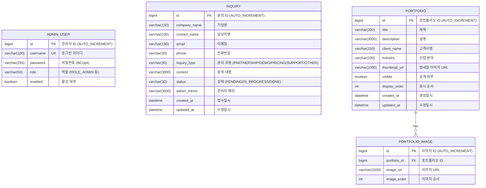

# SalesBoost

B2B 수출 업무를 지원하는 웹 서비스 프로젝트입니다.  
Public 화면(서비스 소개/포트폴리오/제휴문의)과 Admin 화면(로그인/문의관리/포트폴리오관리)으로 구성됩니다.

---

## 1. 프로젝트 목표

- **Public**: 서비스 가치 전달, 포트폴리오 노출, 제휴 문의 유입
- **Admin**: 문의 처리 효율화, 포트폴리오 운영(등록/수정/삭제/노출관리)

---

## 2. 기술 스택

| 구분 | 기술 |
|------|------|
| **Backend** | Java 21, Spring Boot 3.5.10, Spring Security, JPA, MyBatis |
| **Frontend** | Vue.js 3, Vite 7, Tailwind CSS 4, Pinia, Vue Router 4, Axios |
| **Database** | MariaDB 10.11 |
| **API 문서** | Swagger / springdoc-openapi 2.8 |
| **인프라** | Docker, Docker Compose, Kubernetes, Nginx |
| **인증** | JWT (jjwt 0.12.6) |
| **빌드** | Gradle 8 (Backend), npm (Frontend) |

---

## 3. 아키텍처

```
┌─────────────┐     ┌──────────────────┐     ┌────────────┐
│   Browser    │────▶│  Nginx (:80)     │────▶│  Vue.js    │
│   (Client)   │     │  (Reverse Proxy) │     │  Frontend  │
└─────────────┘     └──────┬───────────┘     └────────────┘
                           │ /api/*
                    ┌──────▼───────────┐
                    │  Spring Boot     │
                    │  Backend (:8080) │
                    └──────┬───────────┘
                           │
                    ┌──────▼───────────┐
                    │  MariaDB (:3306) │
                    └──────────────────┘
```

---

## 4. ERD (Entity Relationship Diagram)

> 원본 파일: [`docs/SalesBoost_ERD.mermaid`](docs/SalesBoost_ERD.mermaid)



### 테이블 요약

| 테이블 | 설명 |
|--------|------|
| `admin_user` | 관리자 계정 (BCrypt 비밀번호, 역할 기반 접근 제어) |
| `inquiry` | 제휴 문의 (PENDING → IN_PROGRESS → DONE 워크플로우) |
| `portfolio` | 포트폴리오 (공개/비공개, 표시 순서 관리) |
| `portfolio_image` | 포트폴리오 상세 이미지 (1:N 관계, 순서 지원) |

---

## 5. 디렉터리 구조

```text
be22-4st-team2-project/
├─ README.md
├─ .gitignore
├─ .editorconfig
├─ .env.example               # ⭐ 환경변수 템플릿 (Git 추적 O)
├─ .env                       # 실제 환경변수 파일   (Git 추적 X)
├─ .github/
│  ├─ ISSUE_TEMPLATE/         # 이슈 템플릿
│  └─ PULL_REQUEST_TEMPLATE.md
├─ docs/
│  ├─ SalesBoost_ERD.mermaid  # ERD (Mermaid)
│  ├─ API_IMPLEMENTATION.md   # API 상세 문서
│  ├─ IMPLEMENTATION_SUMMARY.md
│  ├─ requirements.md
│  ├─ 01_프로젝트_기획서.docx
│  └─ 03_요구사항_정의서.docx
├─ frontend/                   # Vue.js 3 프론트엔드
│  ├─ package.json
│  ├─ vite.config.js
│  ├─ Dockerfile               # Nginx 기반 프로덕션 빌드
│  ├─ nginx.conf
│  ├─ .env.development
│  ├─ .env.production
│  └─ src/
│     ├─ App.vue
│     ├─ main.js
│     ├─ style.css
│     ├─ router/index.js       # 라우팅 (Public + Admin)
│     ├─ stores/               # Pinia 상태관리
│     │  ├─ auth.js
│     │  ├─ inquiry.js
│     │  └─ portfolio.js
│     ├─ services/api.js       # Axios API 클라이언트
│     ├─ components/
│     │  ├─ layout/
│     │  │  ├─ TheHeader.vue
│     │  │  └─ TheFooter.vue
│     │  └─ HelloWorld.vue
│     └─ views/
│        ├─ HomeView.vue       # 랜딩 페이지
│        ├─ ServiceView.vue    # 서비스 소개
│        ├─ PortfolioView.vue  # 포트폴리오 목록/상세
│        ├─ InquiryView.vue    # 제휴 문의
│        └─ admin/
│           ├─ AdminLoginView.vue
│           ├─ AdminInquiriesView.vue
│           └─ AdminPortfoliosView.vue
├─ src/                        # Spring Boot 백엔드
│  ├─ main/
│  │  ├─ java/com/salesboost/
│  │  │  ├─ SalesBoostApplication.java
│  │  │  ├─ common/
│  │  │  │  ├─ exception/      # 글로벌 예외 처리
│  │  │  │  └─ response/       # API 응답 래퍼
│  │  │  ├─ config/
│  │  │  │  └─ SwaggerConfig.java
│  │  │  ├─ domain/
│  │  │  │  ├─ admin/          # 관리자 인증
│  │  │  │  │  ├─ controller/
│  │  │  │  │  ├─ dto/
│  │  │  │  │  ├─ entity/
│  │  │  │  │  ├─ repository/
│  │  │  │  │  └─ service/
│  │  │  │  ├─ inquiry/        # 제휴 문의
│  │  │  │  │  ├─ controller/
│  │  │  │  │  ├─ dto/
│  │  │  │  │  ├─ entity/
│  │  │  │  │  ├─ mapper/      # MyBatis 쿼리
│  │  │  │  │  ├─ repository/
│  │  │  │  │  └─ service/
│  │  │  │  └─ portfolio/      # 포트폴리오
│  │  │  │     ├─ controller/
│  │  │  │     ├─ dto/
│  │  │  │     ├─ entity/
│  │  │  │     ├─ repository/
│  │  │  │     └─ service/
│  │  │  └─ security/          # Spring Security + JWT
│  │  │     ├─ SecurityConfig.java
│  │  │     ├─ auth/
│  │  │     └─ jwt/
│  │  └─ resources/
│  │     ├─ application.yml
│  │     └─ mappers/           # MyBatis XML
│  └─ test/
├─ infra/
│  ├─ docker/
│  │  ├─ mariadb/init.sql      # DB 초기화 스크립트
│  │  └─ nginx/                # Nginx 설정
│  └─ k8s/
│     ├─ common.yaml
│     ├─ ingress.yaml
│     └─ deployments/
│        ├─ backend.yaml
│        ├─ frontend.yaml
│        └─ db.yaml
├─ scripts/
│  ├─ dev.sh
│  ├─ build.sh
│  └─ deploy.sh
├─ docker-compose.yml          # 로컬/배포용 Docker Compose
├─ Dockerfile                  # 백엔드 Docker 이미지
├─ build.gradle
├─ settings.gradle
├─ gradlew / gradlew.bat
└─ gradle/
```

---

## 6. 요구사항 범위

### 6.1 Public (FR-01~FR-10)

- 랜딩 페이지
- 서비스 소개 / 프로세스 흐름
- 포트폴리오 목록 / 상세
- 제휴문의 등록 / 완료 안내
- 반응형, 헤더/푸터 공통 UI

### 6.2 Admin (FR-11~FR-20)

- 관리자 로그인 (JWT)
- 제휴문의 목록 / 상세 / 상태변경 / 메모
- 포트폴리오 목록 / 등록 / 수정 / 삭제 / 노출관리

### 6.3 Non-Functional (NF-01~NF-09)

- 성능 (초기 로딩 3초 이내 목표)
- 보안 (BCrypt, CORS, XSS 대응)
- 배포 (Docker / K8s)
- 유지보수 (코드 컨벤션, API 문서화)
- 브라우저 호환성

---

## 7. API 요약

### 7.1 Public API

| Method | Endpoint | 설명 |
|--------|----------|------|
| `GET` | `/api/portfolios` | 포트폴리오 목록 조회 |
| `GET` | `/api/portfolios/{id}` | 포트폴리오 상세 조회 |
| `POST` | `/api/inquiries` | 제휴 문의 등록 |

### 7.2 Admin API

| Method | Endpoint | 설명 |
|--------|----------|------|
| `POST` | `/api/admin/login` | 관리자 로그인 |
| `GET` | `/api/admin/inquiries` | 문의 목록 조회 |
| `GET` | `/api/admin/inquiries/{id}` | 문의 상세 조회 |
| `PATCH` | `/api/admin/inquiries/{id}/status` | 문의 상태 변경 |
| `PATCH` | `/api/admin/inquiries/{id}/memo` | 문의 메모 수정 |
| `GET` | `/api/admin/portfolios` | 포트폴리오 목록 조회 |
| `POST` | `/api/admin/portfolios` | 포트폴리오 등록 |
| `PUT` | `/api/admin/portfolios/{id}` | 포트폴리오 수정 |
| `DELETE` | `/api/admin/portfolios/{id}` | 포트폴리오 삭제 |
| `PATCH` | `/api/admin/portfolios/{id}/visibility` | 포트폴리오 공개/비공개 전환 |

> 📖 상세 API 문서: [`docs/API_IMPLEMENTATION.md`](docs/API_IMPLEMENTATION.md)  
> 🔗 Swagger UI: `http://localhost:8080/swagger-ui.html` (로컬 실행 시)

---

## 8. 로컬 실행

### 8.1 사전 요구사항

- Docker Desktop (권장) — Backend, Frontend, DB 모두 컨테이너로 실행
- 또는: Java 21+, Node.js 20+, MariaDB 10.11+ (개별 실행 시)

### 8.2 Docker Compose로 전체 실행 (권장)

**① 환경변수 파일 생성** (최초 1회)

```bash
# macOS / Linux
cp .env.example .env

# Windows
copy .env.example .env
```

**② `.env` 파일 수정** (선택 — 기본값으로도 동작)

`.env` 파일을 열면 아래와 같은 내용이 있습니다. 빠른 테스트라면 수정 없이 그대로 사용해도 됩니다.
프로덕션 배포 시에는 반드시 강력한 비밀번호와 JWT 시크릿으로 변경하세요.

```dotenv
DB_ROOT_PASSWORD=changeme_root   # MariaDB root 비밀번호 (관리용)
DB_USERNAME=salesboost           # 앱 전용 DB 유저 이름
DB_PASSWORD=salesboost           # 앱 전용 DB 유저 비밀번호
APP_JWT_SECRET=change-this-to-very-long-secret-key-at-least-32bytes
APP_CORS_ALLOWED_ORIGINS=http://localhost,http://localhost:80
```

> **Windows에서 MariaDB 포트 접근이 안 될 때**: `.env`에 `DB_HOST_BIND=0.0.0.0` 추가
> (기본값은 `127.0.0.1` — Mac/Linux 환경에 맞는 안전한 기본값입니다)

**③ 전체 빌드 & 실행**

```bash
docker compose up --build
```

처음 실행 시 이미지 빌드에 수 분이 소요됩니다. 완료 후 브라우저에서 확인하세요.

| 서비스 | 주소 | 설명 |
|--------|------|------|
| 웹사이트 (Frontend) | <http://localhost> | Vue.js SPA + Nginx 서빙 |
| 관리자 페이지 | <http://localhost/admin/login> | 로그인: `admin` / `admin1234!` |
| Backend API | <http://localhost:8080> | Spring Boot (직접 접근 불필요) |
| Swagger UI | <http://localhost:8080/swagger-ui.html> | API 문서 |

> **데이터 초기화**: `docker compose down -v && docker compose up --build`
> (`-v` 옵션으로 DB 볼륨을 제거하면 init.sql이 다시 실행되어 샘플 데이터가 초기 삽입됩니다)

### 8.3 개별 실행 (Docker 없이)

**MariaDB**: Docker 또는 로컬 MariaDB 설치 후 `infra/docker/mariadb/init.sql` 실행

**Backend:**
```bash
# DB가 실행 중인 상태에서:
export SPRING_DATASOURCE_URL=jdbc:mariadb://localhost:3306/salesboost?allowPublicKeyRetrieval=true&useSSL=false
export SPRING_DATASOURCE_USERNAME=salesboost
export SPRING_DATASOURCE_PASSWORD=salesboost
./gradlew bootRun
# → http://localhost:8080
```

**Frontend:**
```bash
cd frontend
npm install
npm run dev
# → http://localhost:5173 (백엔드 http://localhost:8080으로 프록시됨)
```

### 8.4 테스트

```bash
./gradlew test
```

### 8.5 프로덕션 빌드

```bash
./gradlew clean build
```

---

## 9. 환경 변수 / 설정

### 9.1 환경변수 파일 구조

| 파일 | Git 추적 | 용도 |
|------|----------|------|
| `.env.example` | ✅ 추적 O | 팀 공유용 템플릿. 실제 민감값 없이 변수명과 설명만 포함 |
| `.env` | ❌ 추적 X | 로컬·배포 실제 설정값. 민감 정보 포함 |
| `src/main/resources/application.yml` | ✅ 추적 O | Spring Boot 기본 설정. 환경변수 참조(`${VAR:-default}`) |
| `frontend/.env.development` | ✅ 추적 O | Vue.js 개발 환경 변수 |
| `frontend/.env.production` | ✅ 추적 O | Vue.js 프로덕션 환경 변수 |

### 9.2 환경변수 목록

| 변수 | 기본값 | 설명 |
|------|--------|------|
| `DB_DATABASE` | `salesboost` | MariaDB 데이터베이스 이름 |
| `DB_ROOT_PASSWORD` | `changeme_root` | MariaDB **root** 비밀번호 (관리용) ⚠️ 프로덕션에서 반드시 변경 |
| `DB_USERNAME` | `salesboost` | 앱 전용 DB 유저 이름 (root 대신 사용) |
| `DB_PASSWORD` | `salesboost` | 앱 전용 DB 유저 비밀번호 ⚠️ 프로덕션에서 반드시 변경 |
| `DB_HOST_BIND` | `127.0.0.1` | MariaDB 포트 바인딩 IP. Windows에서 접근 안 될 때 `0.0.0.0`으로 변경 |
| `APP_JWT_SECRET` | `change-this-...` | JWT 서명 시크릿 ⚠️ 32바이트 이상, 프로덕션에서 반드시 변경 |
| `APP_CORS_ALLOWED_ORIGINS` | `http://localhost,http://localhost:80` | CORS 허용 오리진 (쉼표 구분) |

> `SPRING_DATASOURCE_USERNAME` / `SPRING_DATASOURCE_PASSWORD` 는 `docker-compose.yml`이
> `DB_USERNAME` / `DB_PASSWORD` 값을 읽어 Spring Boot에 자동으로 주입하므로 `.env`에 별도 설정 불필요합니다.

### 9.3 설정 우선순위

```
[높음] docker-compose.yml의 environment 섹션에서 주입된 환경변수
         ↕ (docker-compose는 .env 파일을 자동으로 읽어 위 값에 보간)
       .env 파일의 값  →  없으면 docker-compose.yml의 ${VAR:-default} 기본값
[낮음] src/main/resources/application.yml 의 ${SPRING_*:fallback} 기본값
```

> 💡 **팀 온보딩 가이드**
>
> 1. `cp .env.example .env` (Windows: `copy .env.example .env`) 실행
> 2. `.env` 파일에서 `DB_ROOT_PASSWORD`, `DB_PASSWORD`, `APP_JWT_SECRET` 값을 강력한 값으로 변경
> 3. `.env` 파일을 절대 Git에 커밋하지 마세요 (`.gitignore`에 등록됨)

---

## 10. 현재 상태

### ✅ 구현 완료

| 영역 | 상태 | 상세 |
|------|------|------|
| **백엔드 API** | ✅ 완료 | 제휴문의/포트폴리오 CRUD, JWT 인증, Spring Security |
| **프론트엔드** | ✅ 완료 | Vue.js 3 SPA - Public 4페이지 + Admin 3페이지 |
| **Docker** | ✅ 완료 | Docker Compose 3-tier (Frontend/Backend/DB) |
| **K8s** | ✅ 완료 | Deployment + Service + Ingress 매니페스트 |
| **API 문서** | ✅ 완료 | Swagger/OpenAPI 자동 생성 |
| **GitHub Templates** | ✅ 완료 | Issue/PR 템플릿 |

### 구현 상세

**백엔드:**
- ✅ 제휴문의 등록/조회/관리 API (FR-06, FR-11~FR-14)
- ✅ 포트폴리오 CRUD + 공개설정 + 순서관리 (FR-04, FR-05, FR-15~FR-20)
- ✅ 관리자 인증 - JWT 발급/검증 (FR-11)
- ✅ Spring Security 설정 (BCrypt, CORS)
- ✅ MyBatis 동적 쿼리 (검색/필터링/페이징)
- ✅ 유효성 검증 + 글로벌 예외 처리
- ✅ URL 기반 썸네일 관리 (포트폴리오 이미지)

**프론트엔드:**
- ✅ 랜딩 페이지 (`HomeView`)
- ✅ 서비스 소개 (`ServiceView`)
- ✅ 포트폴리오 목록/상세 (`PortfolioView`)
- ✅ 제휴 문의 폼 (`InquiryView`)
- ✅ 관리자 로그인 (`AdminLoginView`)
- ✅ 문의 관리 (`AdminInquiriesView`)
- ✅ 포트폴리오 관리 (`AdminPortfoliosView`)
- ✅ 공통 레이아웃 - Header/Footer
- ✅ Pinia 상태관리 (auth, inquiry, portfolio)
- ✅ 인증 가드 (라우터 네비게이션 가드)

**인프라:**
- ✅ Backend Dockerfile (Multi-stage: Amazon Corretto 21 빌드 → 실행)
- ✅ Frontend Dockerfile (Multi-stage: Node 20 빌드 → Nginx 서빙)
- ✅ Docker Compose (Backend + Frontend + MariaDB)
- ✅ K8s manifests (Deployments, Services, Ingress)

---

## 11. 문서

| 문서 | 경로 | 설명 |
|------|------|------|
| 프로젝트 기획서 | `docs/01_프로젝트_기획서.docx` | 프로젝트 기획 문서 |
| 요구사항 정의서 | `docs/03_요구사항_정의서.docx` | 상세 요구사항 |
| API 상세 문서 | `docs/API_IMPLEMENTATION.md` | API 엔드포인트 상세 |
| 구현 요약 | `docs/IMPLEMENTATION_SUMMARY.md` | 백엔드 구현 요약 |
| ERD | `docs/SalesBoost_ERD.mermaid` | 데이터베이스 ERD |

---

## 12. 빌드 성공 확인

```bash
$ ./gradlew clean build
BUILD SUCCESSFUL in 2s
```
